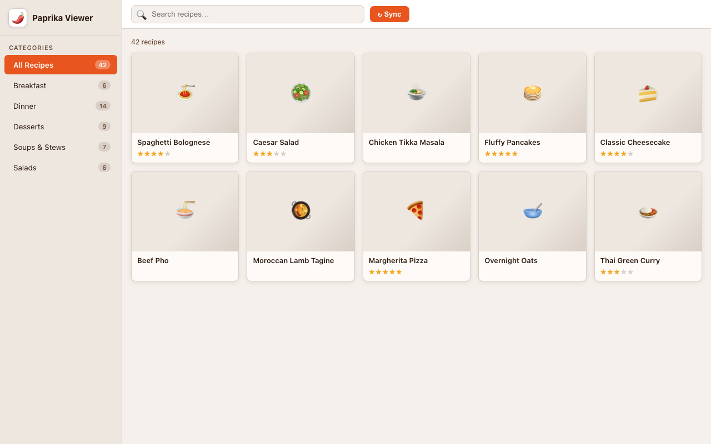
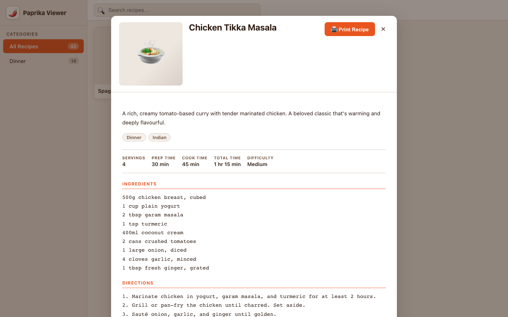

# Paprika Viewer

I wanted to print Paprika recipes from my Mac, so I vibe coded this up with Claude's help. I wrote zero lines of code. Claude wrote it all. 

A read-only macOS desktop app for browsing your [Paprika 3](https://www.paprikaapp.com) recipe library. Built with [Tauri 2](https://tauri.app) (Rust backend) and [Rust Paprika API fork](https://github.com/tdresser/rust-paprika-api-fork/) and React/TypeScript.

## Screenshots

### Recipe Library


### Recipe Detail


## Features

- **Browse all recipes** in a thumbnail grid, sorted alphabetically
- **Search** with real-time filtering and autocomplete suggestions
- **Filter by category** — combinable with name search
- **Recipe detail view** — photo, description, ingredients, directions, notes, nutritional info, and source link
- **Print support** — native macOS print dialog, formatted for 8.5×11" letter paper with 1-inch margins
- **Auto-sync on launch** — hash-based diffing so only changed recipes are downloaded
- **Offline-capable** — recipes and photos cached locally in SQLite
- **Secure login** — Paprika credentials stored in macOS Keychain; auto-login on relaunch

## Requirements

- macOS 12+
- A [Paprika 3](https://www.paprikaapp.com) account with recipes synced to the cloud

To build from source you also need:
- [Rust](https://rustup.rs) (installed via `rustup`)
- Node.js 18+
- [Homebrew](https://brew.sh) with `create-dmg` (`brew install create-dmg`)

## Installation

### Option 1 — Build from source (recommended)

```bash
# Clone the repo
git clone https://github.com/WhatsUpBucho/PaprikaViewer.git
cd PaprikaViewer

# Install frontend dependencies
npm install

# Build the release app + DMG installer
npm run tauri build
```

The `.dmg` installer will be at `src-tauri/target/release/bundle/dmg/`. Open it and drag **Paprika Viewer** to your Applications folder.

### Option 2 — Install the .app directly (skip the DMG)

After building, you can copy the app bundle straight to Applications:

```bash
cp -r "src-tauri/target/release/bundle/macos/Paprika Viewer.app" /Applications/
```

Since the app isn't notarized, macOS Gatekeeper will block it on first launch. Clear the quarantine flag to fix this:

```bash
xattr -dr com.apple.quarantine "/Applications/Paprika Viewer.app"
```

Then launch it normally from Spotlight, Launchpad, or the Applications folder.

### Option 3 — Run in development mode

```bash
npm install
npm run tauri dev
```

## Usage

1. **Sign in** — on first launch, enter your Paprika account email and password. Your auth token is saved in the macOS Keychain.
2. **Sync** — the app syncs your recipe library automatically on every launch. Only changed recipes are downloaded.
3. **Browse** — recipes appear in an alphabetical thumbnail grid. Click any recipe to open the full detail view.
4. **Search** — type in the search bar to filter recipes by name in real time. An autocomplete dropdown suggests matches as you type.
5. **Filter by category** — click a category in the left sidebar to show only those recipes. Category and name filters work together.
6. **Print a recipe** — open any recipe and click **🖨 Print Recipe** in the top-right corner to open the native macOS print dialog. The printout shows only the recipe content (no app chrome), formatted for 8.5×11" letter paper with 1-inch margins.
7. **Auto-login** — subsequent launches skip the sign-in screen and go straight to syncing.

## Tech Stack

| Layer | Technology |
|---|---|
| App shell | Tauri 2 (Rust + WebKit) |
| Backend | Rust — tokio, rusqlite, keyring |
| Paprika API | [rust-paprika-api-fork](https://github.com/tdresser/rust-paprika-api-fork) |
| Database | SQLite (via tokio-rusqlite) |
| Frontend | React 18 + TypeScript + Vite 5 |
| Styling | CSS custom properties, Paprika-inspired theme |

## License

MIT
